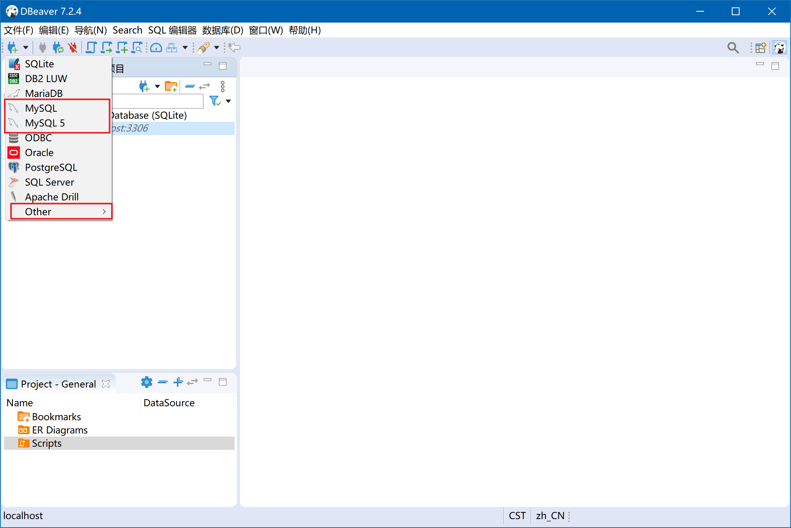
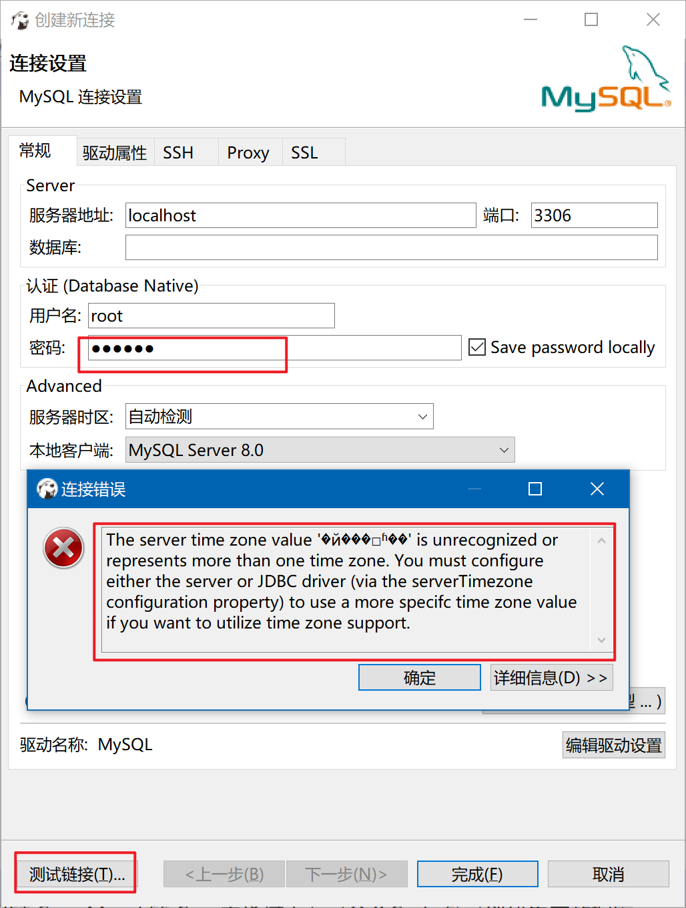
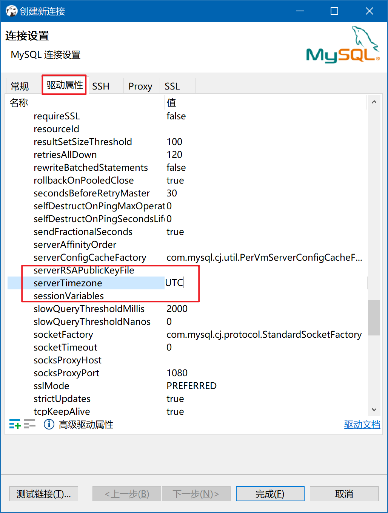
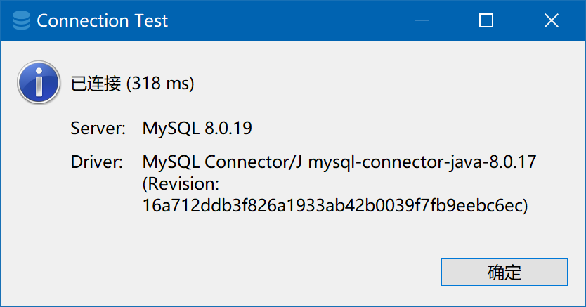

# DBeaver

DBeaver 是一款跨平台的数据库工具，界面友好，支持主题设置，关键字高亮，支持导出 ER 图，支持多种数据库，企业版支持 nosql 数据库。

## 下载地址 

GitHub说明文档：https://github.com/dbeaver/dbeaver

GitHub release（下载较快）：https://github.com/dbeaver/dbeaver/releases

官网地址：https://dbeaver.io/

## 出现问题

我尝试连接MySQL数据库，需要下载Java环境下运行MySQL的驱动，连接的时候出现一点问题:

1. 我使用的MySQL版本是8.x，而连接首选项一开始只有版本5.x，需要在other中选择，打开后会更惊讶，因为他居然有好多许多很多超多非常多的数据库可以进行连接。

   # DBeaver

   DBeaver 是一款跨平台的数据库工具，界面友好，支持主题设置，关键字高亮，支持导出 ER 图，支持多种数据库，企业版支持 nosql 数据库。

   ## 下载地址 

   GitHub说明文档：https://github.com/dbeaver/dbeaver

   GitHub release（下载较快）：https://github.com/dbeaver/dbeaver/releases

   官网地址：https://dbeaver.io/

   ## 出现问题

   我尝试连接MySQL数据库，需要下载Java环境下运行MySQL的驱动，连接的时候出现一点问题:

   1. 我使用的MySQL版本是8.x，而连接首选项一开始只有版本5.x，需要在other中选择，打开后会更惊讶，因为他居然有好多许多很多超多非常多的数据库可以进行连接。

      

   2. 创建新连接之后，输入密码并测试连接，将会出现一个无法识别时区的错误。

      

   3. 在选择驱动属性，找到severTimezone，将值设置为UTC，再次测试连接。

      

   4. 就可以看到顺利完成连接。

      

   5. 之后就可以愉快工作了。